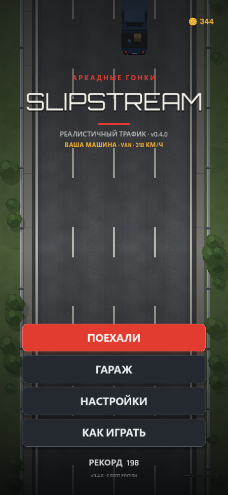
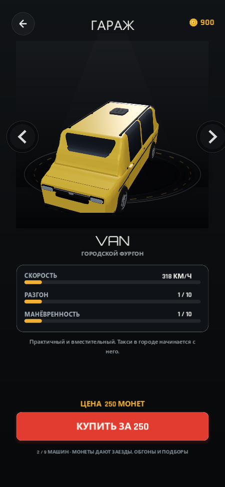
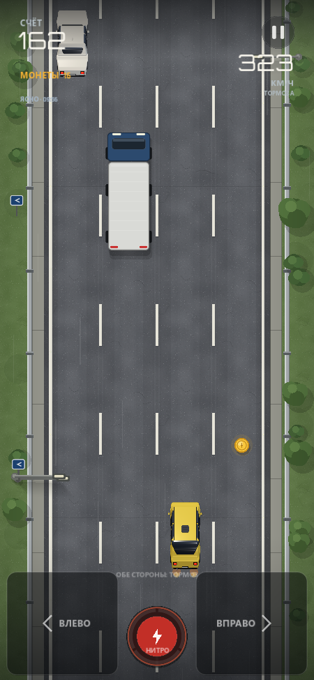
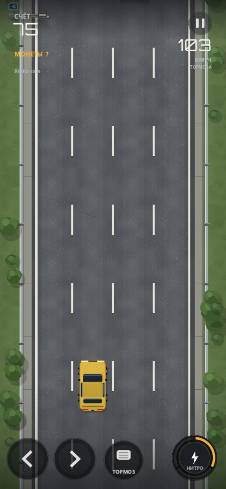
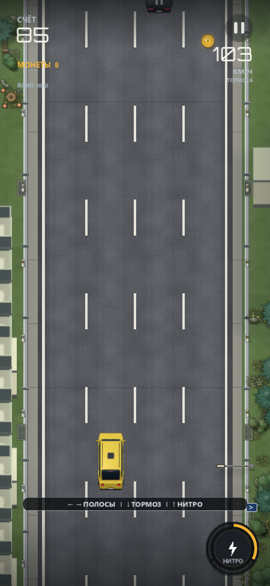
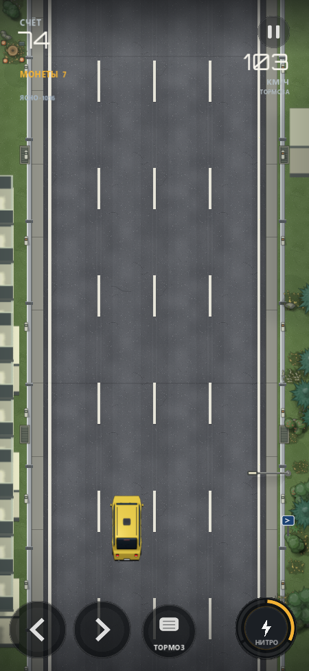
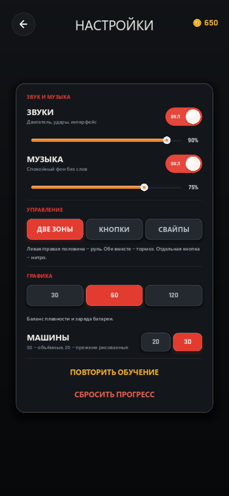
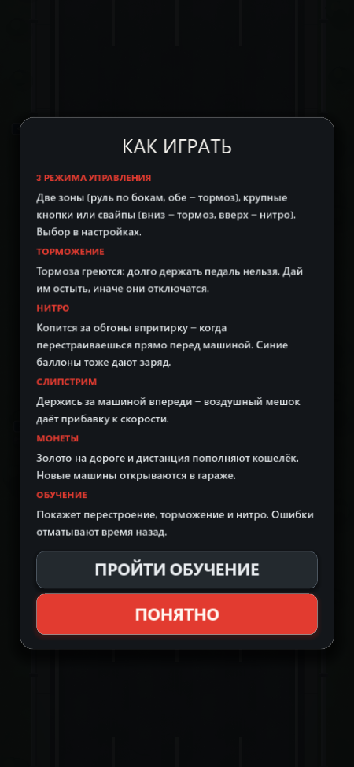
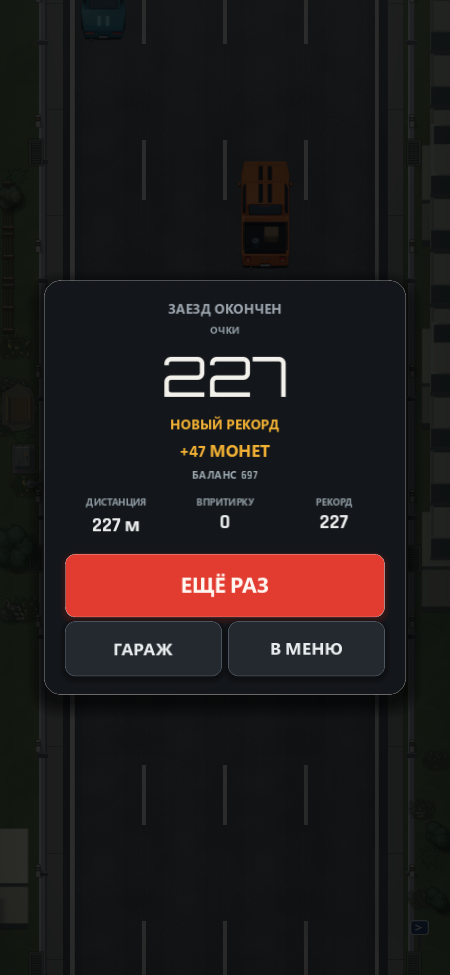
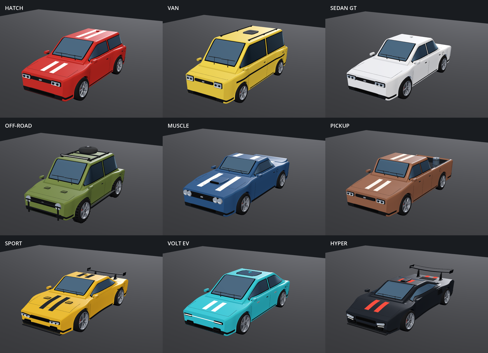

# SLIPSTREAM

**Аркадный трафик-рейсер для Android · книжная ориентация · версия 0.7.7**

[](https://godotengine.org/)
[](https://www.android.com/)
[](../../releases/latest)

[**Скачать APK**](../../releases/latest) · [Скриншоты](#скриншоты) · [Управление](#управление) · [Сборка](#сборка-apk)

Четыре полосы, бесконечный поток, драйв в портретном режиме. Гараж с девятью машинами, игровые монеты,
три типа управления на выбор, обучение с замедлением времени, тормоз и нитро по нажатию. Проезд впритирку даёт серию, монеты и заряд нитро.

Графика создаётся кодом, а изображения машин для заезда заранее сохраняются в атласы.
Звук — синтез и записи CC0 ([источники](docs/credits.md)), фоновая музыка синтезируется на лету.

---

## Что нового в 0.7.7

- В гараже машина мягко вращается за пальцем и сама возвращается в ракурс в три четверти. У карусели появилась инерция и мягкое прилипание к карточкам.
- Свет уличных фонарей ложится под металлические крышки. Фары автобусов освещают дорогу перед собой.
- Обычный дождь различим и между фонарями. Ливень остаётся плотнее.

[Заметки к версии 0.7.7](docs/releases/0.7.7.md).

## Что было в 0.7.6

- В гараже появилась карусель с миниатюрами, стрелки переключения и каталог «Все машины».
- Экран гаража помещается в портретной ориентации. Цена стоит крупно рядом с кнопкой покупки.
- Машины вращаются по горизонтали на 360° с фиксированной дистанцией камеры.
- Нажатие на способность открывает одну из девяти коротких сцен с механикой заезда.

[Заметки к версии 0.7.6](docs/releases/0.7.6.md).

## Что было в 0.7.5

- Две кнопки поворота включают тормоз при втором касании без рывка. Скорость после торможения набирается плавнее.
- Двойное нажатие нитро расходует весь запас и продлевает ускорение.
- Фары мягче освещают кузова, конусы заметнее ночью, солнечные тени меняют направление и длину.
- В гараже можно вращать все девять моделей. В вызовах появились отдельные вкладки, прогресс медалей и 3D-призраки.
- Дуэли с друзьями работают через файлы заездов. Приглашение содержит код из восьми знаков и ссылку на RuStore.

[Заметки к версии 0.7.5](docs/releases/0.7.5.md).

## Что было в 0.7.4

- Солнце движется по небу, тени меняются в течение дня. Тени отбрасывают фонари, мосты, знаки, конусы, монеты и батарейки.
- Сутки длятся 18 минут, ночь около 5,5 минуты. После аварии время продолжается. Дождь, гроза и туман случаются заметно чаще.
- Крупные часы с иконкой погоды и прогнозом иконкой.
- Кнопки срабатывают в момент касания, без задержки.
- Машины трафика поворачивают кузов при перестроении.
- Очки и нитро за сбитые конусы и знаки, серии и бонус за все конусы. Новые раскопки.
- Широкий пешеходный мост, неравномерные фонари, кнопка «ПОЕХАЛИ» в гараже. Баннер не закрывает «Назад» в настройках.

[Заметки и параметры 0.7.4](docs/releases/0.7.4.md).

## Что было в 0.7.3

- Сутки длятся 24 минуты, заезд продолжает время и погоду меню. Блэкаут бывает только в темноте.
- Уведомления выводятся простым текстом под счётом, реже и без рутинных манёвров.
- У автобуса исправлены фары. Покрытия меняются ещё втрое реже, швы бетонных плит стали мягче.
- Фонари и переходы над трассой рисуются поверх машин. Перемотка возвращает дорожные работы вместе с дорогой.
- Баннер стал тонкой полосой у верхнего края и обновляется каждые 45 секунд.

[Заметки и параметры 0.7.3](docs/releases/0.7.3.md).

## Что было в 0.7.2

- Покрытия меняются реже, заплатки плавно переходят в основной асфальт.
- Ограждения движутся вместе с дорогой, между ними видны раскопки. Над трассой изредка появляются переходы и порталы со знаками.
- Полоска личного рекорда оформлена как радар, уведомления появляются в очереди у верхнего края.
- У фур уточнены позиции фар, шлейфы и отражения света плавно затухают. Монеты и батарейки подсвечены ночью.
- Капли вытягиваются по направлению движения. Android-баннер учитывает нативный размер и повторяет загрузку при тайм-ауте.

[Заметки и параметры 0.7.2](docs/releases/0.7.2.md).

## Что было в 0.7.1

- **Фары точно на местах** у каждой машины в 3D и 2D, лучи по ширине фар, мягкие края,
  фары горят ещё до появления машины на экране.
- **Фонари светят сверху**, капли на экране стекают вниз и собираются у краёв.
- **Асфальт:** чёткая текстура, плавная смена покрытий, четыре новых покрытия, тонкая
  жёлтая разметка.
- **Трафик** перестраивается реже и безопаснее, **дорожные работы** со знаками, конусами
  и барьером.
- **Звук:** громче визг шин, мягче «рогатка». **Реклама:** баннер и в заезде.
  **Авто-графика** точнее на мощных телефонах.

[Заметки к 0.7.1](docs/releases/0.7.1.md).

## Что было в 0.7.0

- **Настоящий свет.** Фары, стопы, фонари и нитро освещают асфальт и машины и отбрасывают
  тени в реальном времени. Ночью видно только освещённое, за машинами тянутся световые шлейфы.
- **Асфальт.** Процедурный материал с рельефом: свежий, старый с трещинами, колея, бетонные
  плиты со швами, ремонтные участки. В дождь темнеет и блестит, после дождя сохнет неравномерно.
- **Дождь.** Три слоя капель, видимых в свете фар, брызги и круги на лужах, отражения огней
  на мокрой дороге, водяная пыль из-под колёс, капли на экране, которые стекают и сдуваются.
- **Туман.** Многослойный, разной плотности: в плотном верх экрана почти не виден. Лучи фар,
  ореолы фонарей и красный отсвет стопов рассеиваются в нём.
- **Искры и следы шин.** Физические искры с остыванием цвета и сдержанным свечением, следы
  каждого колеса (резина на сухом, выдавленная вода на мокром), дым при торможении.
- **Торможение зависит от погоды:** на мокром дольше, в лужах ещё дольше, на глубокой воде
  возможно короткое аквапланирование.
- **Новый звук:** двигатель своего характера у каждой из девяти машин, нитро, визг шин,
  проезды с допплером, многослойные аварии, дождь, гром и эмбиент по времени суток и погоде.
- **Механики:** «Рогатка» из воздушного мешка, «Хроно-щит», дорожные события, перестроения
  трафика с поворотниками, дуэли с призраком друга по коду и ежедневный вызов.
- **Реклама Яндекса:** баннер в меню, гараже и на финише; возрождение за рекламу один раз за заезд
  (кроме дуэлей и вызова дня).
- **Настройка графики:** Низко / Средне / Высоко / Ультра / Авто.

[Полные заметки к релизу](docs/releases/0.7.0.md).

## Дуэли с друзьями без сервера

После заезда нажми «Поделиться вызовом». На Android откроется меню отправки с текстом приглашения и файлом `.slipstream`.
На ПК игра предложит сохранить файл и скопирует приглашение в буфер обмена.

Короткий код в сообщении совпадает с кодом в имени вложения. Запись призрака хранится в самом файле.
Чтобы принять вызов, сохрани вложение и выбери «Открыть файл заезда» в разделе «Вызовы → Дуэли с друзьями».
Полный код `SLIP…` тоже можно передать и вставить как обычный текст.

## Скриншоты

| Меню | Гараж |
|:---:|:---:|
|  |  |

| Игра: зоны (3D) | Игра: 2D-режим |
|:---:|:---:|
|  |  |

| Игра: свайпы | Игра: кнопки |
|:---:|:---:|
|  |  |

| Настройки | Как играть |
|:---:|:---:|
|  |  |

| Финиш | |
|:---:|:---:|
|  | |

### Обновлённые модели 0.6.0



### Карточки и материалы для RuStore

Готовые материалы для консоли разработчика находятся в каталоге [`docs/rustore/`](docs/rustore/).

- [Текст «Что нового?» для перехода с 0.2.1](docs/rustore/whats_new_0.7.7.txt).
- [`icon_512.png`](docs/rustore/icon_512.png) — *Иконка приложения 512×512 px (Full Bleed квадрат без артефактов маскирования)*
- [`card_1_gameplay.png`](docs/rustore/card_1_gameplay.png) — *Ночная трасса и движение в потоке (1080×1920 px)*
- [`card_2_bullet_time.png`](docs/rustore/card_2_bullet_time.png) — *Нитро и обгоны (1080×1920 px)*
- [`card_3_garage.png`](docs/rustore/card_3_garage.png) — *Девять машин и обзор гаража (1080×1920 px)*
- [`card_4_controls.png`](docs/rustore/card_4_controls.png) — *Кнопки и три схемы управления (1080×1920 px)*
- [`overview_cards.png`](docs/rustore/overview_cards.png) — *Сводный коллаж 2×2*

## APK

Локальная сборка версии из этого репозитория создаёт **`Slipstream-0.7.7.apk`**.
Опубликованные сборки доступны в разделе [**Releases**](../../releases/latest).

| | |
|---|---|
| Пакет | `com.slipstream.game` |
| Версия | 0.7.7 (versionCode 24) |
| Android | 7.0+ (minSdk 24), targetSdk 36 |
| Архитектура | arm64-v8a (64-бит) |
| Подпись | debug-ключом проекта; обновления должны быть подписаны тем же ключом |

Установка:

1. Возьми APK из Releases или собери его локально и перекинь на телефон.
2. Открой файл на телефоне. Если система спросит — разреши установку из этого источника.
3. Play Protect может предупредить, что приложение неизвестное: это нормально для сборки
   вне Google Play, жми «Подробнее» → «Всё равно установить».

Если подключён по USB с включённой отладкой:

```powershell
adb install -r Slipstream-0.7.7.apk
```

## Возможности

- **Интерактивное обучение с замедлением.** При первом заезде (или по кнопке в меню)
  игра эффектно замедляет время (bullet-time) и подсказывает, как перестраиваться, тормозить
  и запускать нитро. Ошибка в обучении не заканчивает заезд: время отматывается на пару секунд назад.
- **Три типа управления на выбор:**
  1. *Две зоны (по умолчанию):* экран разделён на левую и правую зоны (удобно держать телефон двумя руками). Нажатие обеих зон одновременно — тормоз! Нитро — отдельная кнопка по центру.
  2. *Крупные кнопки:* увеличенные сенсорные стрелки поворотов, педаль тормоза и кнопка нитро.
  3. *Свайпы:* влево/вправо — перестроение, свайп вниз — тормоз, свайп вверх — нитро-ускорение.
- **Гараж.** Девять машин с разной скоростью, разгоном и манёвренностью. Превью на подиуме,
  полоски характеристик, цена, покупка и выбор. Купленная машина сразу становится основной.
- **Вид машин 2D/3D.** Переключатель в настройках меняет графику заезда на лету и сохраняется
  в профиле. В режиме 3D на трассе используются заранее запечённые изображения процедурных
  моделей: 681 вариант машин, цветов и полос собран в шесть атласов. При появлении
  трафика игра не строит модели и не считывает изображения с GPU, поэтому новые машины
  не вызывают рывки от запекания. Режим 2D возвращает прежние рисованные машины.
- **Разнообразие трафика.** 11 силуэтов, включая электрокары, масклкары и гиперкары,
  24 цвета кузова, однотонные и полосатые раскраски с контрастными и цветными полосами.
  Для грузовиков подобраны сочетания кабины с 10 цветами грузового кузова, для автобусов —
  сочетания с 8 цветами акцентной полосы. В атласах 672 варианта трафика и 9 машин гаража.
- **Окружение.** Несколько видов деревьев и кустарников, цветы, камни, папоротники,
  ограждения и дорожные объекты. Дома, магазин, амбар, гараж и многоквартирные здания
  отрендерены из процедурных 3D-моделей вместе с отдельными тенями.
- **Игровая валюта.** Монеты за дистанцию, близкие обгоны и золото на дороге. Баланс
  сохраняется между запусками и виден в меню, гараже и на финише.
- **Тормоз с перегревом.** Педаль сбрасывает скорость, но колодки греются. Долго держать тормоз
  нельзя: при перегреве он отключается, и нужно дать ему остыть. Индикатор температуры — в HUD.
- **Нитро за обгоны впритирку.** Шкала из трёх зарядов. Старт с одним. Заряд даёт только
  перестроение прямо перед близкой машиной (а не любой обгон) или синий баллон.
  Нажатие тратит заряд и даёт ×1.5 на 1,6 с.
- **Аэродинамический слипстрим.** Держись за машиной впереди — езда в воздушном мешке снижает сопротивление воздуха и даёт плавную прибавку к скорости и очкам.
- **Плотный трафик и задние угрозы.** При торможении быстрые машины догоняют и появляются снизу экрана — пульсирующие стрелки предупреждают об опасности сзади. Поток не из одного кузова: хэтчбеки и седаны, кроссоверы с рейлингами и запасным колесом, спорткары с антикрылом, фургоны, пикапы с грузом в кузове, грузовики с прицепами и автобусы.
- **Плавная смена дня и ночи за 6 минут.** Бесшовный 360-секундный цикл (день → закат → ночь → рассвет) с плавной интерполяцией по ключевым сценам. Часы в HUD показывают текущее время суток. Мягкие конусы фар трафика, люминесцентные фары и стоп-сигналы игрока, красные отсветы на мокром асфальте и тёплые пятна фонарей.
- **Динамическая погода из 5 состояний.** Ясно, облачно, дождь, гроза и туман плавно перетекают друг в друга в течение секунд (смена каждые 1–2 минуты). Название погоды и время суток — в HUD.
- **Физически честный дождь.** Наклон каждой струи вычисляется из того же вектора ветра, которым капля реально движется, поэтому косые линии никогда не «врут»: порыв ветра гнёт всю завесу разом. Три слоя глубины с собственным параллаксом и разной длиной смаза, капли внутри фар получают тёплый блик, а на лобовом стекле оседают крупные скоростные капли. Численно проверено: измеренный наклон совпадает с расчётным с точностью до 0,5°.
- **Свет фар как физическая модель.** Текстура пятна один раз считается на старте: ближний свет с несимметричной границей, смещённый вбок перегрев-хотспот и два U-образных пятна у бампера — то, из-за чего настоящий ближний свет на асфальте выглядит косым. Пятна на дороге рисуются под машинами, тонкие объёмные конусы и «брови» лампы — поверх, а на мокром асфальте добавляется зеркальная полоса отражения. В тумане и под дождём конусы расширяются и мутнеют, как в реальном свете в воздухе.
- **Мокрый асфальт и водяная пыль.** Отдельная текстура поверхностной воды липнет к разметке и не «плавает», вдоль центров полос идёт холодный блик, вблизи камеры — зеркальная засветка. Каждая машина поднимает шлейф водяной пыли, а у игрока за кормой растёт настоящий петушиный хвост, который подсвечивается фарами.
- **Аддитивные блики без шейдеров.** Все свечения, пятна и отражения — предрасчитанные радиальные текстуры, поэтому мобильный GL-совместимый рендерер держит стабильный кадр: нет ни одного лишнего draw call на источник света.
- **Процедурная детализация дороги.** Фрактальные ветвящиеся трещины со сколами, полигональные выбоины с лужами и гравием, битумные швы и свежие заплаты асфальта, равномерно распределённые по всей трассе.
- **Переработанный синтез звука.** Полный процедурный DSP-движок: рокот V8 с басовым резонансом и турбонаддувом, шум шершавого асфальта и стыков, аэродинамический вихрь слипстрима, дождь, скрежет ABS и предупредительный зуммер перегрева.
- **Панорамный звук обгонов.** Каждая машина, проходящая мимо, даёт короткий доплеровский всвист с понижением тона и уезжает в свой канал: слева или справа. Две отдельные моно-шины с панорамным эффектом дают настоящий стереообзор трафика без нагрузки на процессор, а громкость растёт тем сильнее, чем впритирку прошёл обгон.
- **Звук погоды.** Мокрое покрытие и стёкла в дождь, гул ветра и низкий раскатистый фон грозы подключены к той же погодной модели, что и графика, поэтому картинка и звук меняются синхронно.
- **Фоновая музыка и SFX.** Отдельные шины и независимые переключатели. Клик по строке или тумблеру мгновенно переключает звук.
- **Подтверждение выхода и навигация.** Системная кнопка «Назад» на телефоне плавно возвращает из настроек и гаража на главный экран, а на главном экране открывает диалог подтверждения выхода.

## Гараж

| Машина | Цена | Макс. скорость | Характер |
|---|---:|---:|---|
| **HATCH** | 0 | 330 км/ч | Стартовый городской хэтчбек, лёгкий и послушный |
| **VAN** | 250 | 318 км/ч | Городской фургон, практичный и вместительный |
| **SEDAN GT** | 600 | 351 км/ч | Спортивный седан, быстрее и стабильнее |
| **OFF-ROAD** | 1 000 | 342 км/ч | Кроссовер с рейлингами, багажником и запасным колесом |
| **MUSCLE** | 1 600 | 369 км/ч | Тяжёлый маскл с мощным разгоном |
| **PICKUP** | 2 200 | 357 км/ч | Рабочий пикап с открытым грузовым кузовом |
| **SPORT** | 3 200 | 390 км/ч | Трековое купе с точными реакциями |
| **VOLT EV** | 4 200 | 396 км/ч | Электрокар: тихий, мгновенный и технологичный |
| **HYPER** | 5 600 | 414 км/ч | Гиперкар, вершина гаража |

Скорость в игре растёт с дистанцией от базовой до максимальной у каждой машины.
Все машины различаются силуэтом, цветом, полосами, фарами, фонарями и кузовными деталями,
а диски у каждого класса свои — штампованные, литые, магниевые, внедорожные, спортивные
и аэродинамические, с цветными суппортами, объёмными спицами, ободом и крепежом.

В гараже машина показана объёмной 3D-моделью: кузов и остекление строятся лофтом по
суперэллиптическим сечениям, колёса стоят на своих арках, а классовые детали (рейлинги,
запасное колесо, люстра, кузов пикапа, антикрыло, стеклянная крыша) собираются из
процедурных мешей. Геометрия генерируется кодом при выборе машины. Стёкла имеют
тонировку, отражения и чёрную окантовку; дворники — отдельные рычаги, крепления
и щётки, прилегающие к поверхности стекла. Исправлены арки, ровность крыш и
переход кабины в открытый грузовой кузов пикапа.

В заезде те же модели работают через запечённые спрайты (`race_art.gd`). Атласы
в `godot/art/race/` создаются заранее скриптом `bake_race_art.gd`, входят в ресурсы игры
и загружаются до заезда только в режиме 3D. В режиме 2D они освобождаются. Сохранены цвета кузовов, полосы, цвета грузовых отсеков и
акценты автобусов. Спрайт рисуется внутри хитбокса; переключатель **2D/3D** возвращает
прежний рисованный арт (`art.gd`). После изменения моделей или палитры нужно пересоздать
атласы (команды — в `godot/art/race/README.md`).

## Экраны

| Экран | Что показано |
|---|---|
| **Меню** | Живая дорога на фоне, логотип, выбранная машина, баланс монет, рекорд, кнопки игры |
| **Гараж** | Подиум с машиной, стрелки выбора, скорость / разгон / манёвренность, цена и покупка |
| **Настройки** | Тумблеры звуков и музыки (исправлены), выбор из 3 типов управления, вид машин 2D/3D, частота кадров 30/60/120, повтор обучения, сброс прогресса |
| **Игра** | Счёт, серия, монеты заезда, скорость, слипстрим, температура тормозов, полосы движения, тормоз и нитро, подсказки |
| **Пауза** | Продолжить / настройки / заново / в меню |
| **Финиш** | Очки, новый рекорд, дистанция, «впритирку», заработанные монеты и баланс |
| **Как играть** | Правила, режимы управления, нитро, монеты и кнопка запуска обучения |
| **Подтверждение выхода** | Диалог подтверждения при нажатии системной кнопки «Назад» в меню |

## Управление

- **Две зоны (рекомендуется для двух рук):**
  - Тап/удержание слева — поворот влево;
  - Тап/удержание справа — поворот вправо;
  - Нажатие обеих зон одновременно — ТОРМОЗ;
  - Кнопка по центру — НИТРО.
- **Кнопки:**
  - Увеличенные полупрозрачные `←` `→` слева внизу, `ТОРМОЗ` по центру, `НИТРО` справа.
- **Свайпы:**
  - Свайп влево / вправо — перестроение;
  - Свайп вниз — торможение (удерживай для продления тормоза);
  - Свайп вверх — активация нитро.
- **Системная кнопка «Назад»:**
  - В настройках, гараже, правилах — возврат на предыдущий экран / в меню;
  - В игре — пауза;
  - В меню — диалог подтверждения выхода из игры.
- **На компьютере:** `← →` / `A D` — полосы, `Пробел` — нитро, `↓` / `S` — тормоз, `Esc` — пауза/назад.

## Правила и экономика

1. Машина едет вверх по четырём полосам, попутный трафик медленнее — он приближается.
2. Столкновение — конец заезда. Рекорд, монеты и гараж сохраняются.
3. Очки: дистанция + `10 × комбо` за каждый близкий обгон.
4. Комбо живёт 2,6 с без новых «впритирок».
5. Близкий обгон: `+2` монеты и `+1/3` нитро.
6. Золотая монета на дороге: `+12` монет. Синий баллон: `+1/3` нитро.
7. Нитро: 3 заряда, старт с одним. Нажатие тратит один заряд: ×1.5 на 1,6 с.
8. Тормоз: целевая скорость 42% от обычной. Трафик при этом уезжает вперёд.
9. Заработок за заезд: `дистанция / 10` + подобранные монеты + `2 × обгоны` + 25 за рекорд.
10. Стартовый баланс — 300 монет. Сохранение — `user://slipstream.cfg` на устройстве.

## Как устроено

- **Движок:** Godot 4.7.2-stable, рендер GL Compatibility (работает на широком парке Android).
- **Разрешение:** виртуальный холст 720×1560, режим `canvas_items` + `expand`,
  книжная ориентация, полноэкранный (immersive) режим без системных панелей.
- **Графика:** полностью процедурная. Асфальт и трава — шумовые текстуры, сгенерированные
  в рантайме; мягкие конусы фар и свечение ламп/фонарей — текстуры с настоящим радиальным
  затуханием; дорога, разметка, отбойник, растительность, машины, монеты и баллоны
  рисуются через `_draw()` и `StyleBoxFlat`. Машины в режиме 3D и здания используют
  заранее отрендеренные PNG из процедурных моделей; растительность собирается в атлас при запуске.
- **Машины:** данные и цены — в `cars.gd`, внешний вид (цвет, полосы, крыло) — в `art.gd`.
- **Трафик:** у каждой машины своя стабильная скорость относительно опорной скорости игрока.
  Поэтому нитро реально ускоряет сближение, а тормоз реально отпускает трафик вперёд.
- **Свободная полоса:** ротация каждые 6–9 с; в ней не спавнятся новые машины, поэтому
  глухие пробки из четырёх полос не возникают.
- **Звук:** синтез в `AudioStreamWAV` при старте (двигатель — гармоники + шум, ветер и нитро —
  фильтрованный шум, удар — шум + низкий тон, монеты и баллоны — короткие тоны).
  Две шины: `SFX` и `Music`, громкость и mute независимы.
- **Музыка:** луп 8,1 с (118 BPM, Am–F–C–G), пэды, бас, арпеджио, мягкие барабаны.
  Считается в `WorkerThreadPool`, на главный поток отдаётся готовый буфер.
- **Палитра:** асфальт `#5d6066`, трава `#66804b`, разметка `#f2f0e3`,
  акцент `#e23b30`, янтарный `#f2b134`, интерфейс `#13161a` / `#f3f1ec`.
- **Шрифты:** Orbitron (счёт, заголовки) и Rajdhani (подписи) — `godot/fonts/`,
  распространяются по лицензии SIL Open Font License 1.1.

## Сборка APK

Нужны **Godot 4.7.2-stable** с Android export-шаблонами, **JDK 21** и **Android SDK**
(build-tools, platforms/android-36, platform-tools). Сборка использует Gradle и шаблон
`android_source.zip`. Скрипт `build_apk.bat` подготавливает шаблон и подключает плагин рекламы.

Шаблоны экспорта (220 МБ, в git не попадают) скачиваются один раз:

```powershell
# https://github.com/godotengine/godot/releases/download/4.7.2-stable/Godot_v4.7.2-stable_export_templates.tpz
# установи .tpz через Editor → Manage Export Templates
```

Инструменты SDK подхватываются из переменных окружения (`ANDROID_HOME`, `JAVA_HOME`),
настраивать пути в редакторе не обязательно. `build_apk.bat` также принимает путь
к движку в `GODOT_BIN` и хранит временные файлы в `.work/build-temp`.

Ключ подписи **не хранится в репозитории**. Создай свой debug- или release-keystore
и укажи его в `Project → Export → Android → Keystore` (или в `godot/export_presets.cfg`).
Если собираешь обновление для уже установленной игры, используй **тот же ключ**, которым
она была подписана, иначе Android не даст установить APK поверх.

Важно: в `godot/project.godot` включён импорт ETC2/ASTC
(`rendering/textures/vram_compression/import_etc2_astc=true`) — без него Godot молча
отказывается экспортировать под Android с пустым списком ошибок.

```powershell
$env:ANDROID_HOME = "C:\path\to\Android\Sdk"
$env:JAVA_HOME    = "C:\path\to\jdk-21"

$godot = "C:\path\to\Godot_v4.7.2-stable_win64_console.exe"

# подготовка Android-шаблона и импорт ресурсов
powershell -NoProfile -ExecutionPolicy Bypass -File tools/prepare_android_build.ps1 -GodotExe $godot
& $godot --headless --path godot --import

# релизная сборка (ключ задаётся в export_presets.cfg / диалоге экспорта)
New-Item -ItemType Directory -Force build | Out-Null
& $godot --headless --path godot --export-release "Android" "$PWD\build\Slipstream-0.7.7.apk"
```

Путь экспорта передавай **сразу после** имени пресета и обязательно с расширением
`.apk` — иначе Godot ругается «Неверное имя файла».

Проверка готового файла:

```powershell
# пакет, версия, minSdk, arm64
aapt2 dump badging Slipstream-0.7.7.apk

# подпись и схемы v1/v2/v3
apksigner verify --verbose --print-certs Slipstream-0.7.7.apk

# выравнивание
zipalign -c 4 Slipstream-0.7.7.apk
```

Иконки: `godot/icons/icon_192.png`, `icon_fg_432.png`, `icon_bg_432.png` (адаптивная иконка).

## Проверки

```powershell
& $godot --headless --path godot res://tests/RaceRegression.tscn
& $godot --headless --path godot res://tests/RewardsRegression.tscn
```

Проверяются сенсорное управление, пауза, обучение, награды, независимость от FPS
и каталог атласов. Тесты не записывают сохранение игрока. Подробности —
в [`godot/tests/README.md`](godot/tests/README.md).
Для проверки геометрии и контактных листов моделей:

```powershell
& $godot --path godot --script res://scripts/qa_models_review.gd
```

## Структура

```
Slipstream/
├── README.md
├── .gitignore
├── docs/
│   └── screenshots/            # скриншоты для README
└── godot/                      # проект Godot 4.7.2
    ├── project.godot           # холст 720×1560, GL Compatibility, автолоад Sfx
    ├── export_presets.cfg      # Android-пресет, версия 0.7.0
    ├── scenes/Main.tscn
    ├── scripts/
    │   ├── main.gd             # экраны, HUD, гараж, настройки, сохранения, ввод
    │   ├── game.gd             # дорога, трафик, тормоз, нитро, монеты, столкновения,
    │   │                       #   погода, дождь, свет фар, мокрая дорога
    │   ├── fx.gd               # процедурные текстуры бликов, лучей, капель, мокрого асфальта
    │   ├── cars.gd             # девять машин: цены, скорости, рейтинги
    │   ├── art.gd              # машины, деревья, фонари, знаки, монеты, баллоны
    │   ├── sfx.gd              # синтез SFX + фоновая музыка, шины SFX/Music/PassL/PassR
    │   ├── car_stage.gd        # подиум с вращающимся кольцом, 3D-машина в SubViewport
    │   ├── car_model.gd        # процедурные 3D-модели девяти машин (лофт, колёса, детали)
    │   ├── race_art.gd         # запечённые спрайты 3D-машин для заезда, кэш по цвету и классу
    │   ├── pad_button.gd       # полупрозрачные стрелки и тормоз
    │   ├── nitro_button.gd     # кнопка нитро на три заряда
    │   ├── toggle_switch.gd    # тумблеры настроек
    │   ├── zones_pad.gd        # сенсорные зоны для игры двумя руками
    │   ├── coin_icon.gd        # иконка монеты
    │   └── icon_button.gd      # пауза и «назад»
    ├── art/                    # готовые атласы машин и изображения зданий
    ├── tests/                  # регрессионные проверки
    ├── fonts/                  # Orbitron + Rajdhani (OFL 1.1)
    └── icons/                  # иконки лаунчера
```

## История версий

- **0.7.7** — [плавный гараж, фонари, фары автобусов и дождь](docs/releases/0.7.7.md).
- **0.7.6** — [карусель в гараже, вращение с фиксированной камерой и демо способностей](docs/releases/0.7.6.md).
- **0.7.5** — [полное нитро, плавный разгон, обновлённый гараж и локальные 3D-дуэли](docs/releases/0.7.5.md).
- **0.7.4** — [солнце и тени, время суток, погода, часы, управление, трафик, дорожные работы и гараж](docs/releases/0.7.4.md).
- **0.7.3** — [время суток, уведомления, фары автобуса, асфальт, фонари, перемотка и баннер](docs/releases/0.7.3.md).
- **0.7.2** — [дорога, дорожные работы, рекорд, уведомления, свет, предметы, декор, капли и баннер](docs/releases/0.7.2.md).
- **0.7.1** — [графика, трафик, звук и реклама в заезде](docs/releases/0.7.1.md).
- **0.7.0** — настоящий 2D-свет с тенями, процедурный асфальт, дождь с лужами и каплями на экране, туман с рассеянием света, искры и следы шин, торможение по погоде, полностью новый звук, Рогатка, Хроно-щит, дуэли с призраком, реклама Яндекса, пресеты графики.
- **0.6.0** — переработка моделей, дисков, арок, спойлеров, остекления и дворников; интегрированный кузов пикапа; 681 спрайт машин, грузовики и автобусы в 3D; новые обочины и здания; исправления управления, обучения, наград и зависимости от FPS.

- **0.5.7** — большой проход по качеству 3D-моделей. Кузов собирается из скруглённых сечений с разной шириной сверху и снизу, поэтому боковины получили наклон, а плечи — чёткое ребро; арки — настоящие вырезы, закрытые тёмным днищем, и колёса сидят в открытых нишах. Остекление переписано: панели со скруглёнными углами, чёрная окантовка снаружи стекла и градиент от тёмного салона внизу к небу вверху — в гараже и в заезде нет окружения, поэтому отражение запекается в цвета вершин. Диски стали слоёными: тёмная тарелка, тормозной диск с суппортом, сдвоенные спицы, хромовой обод и ступица. Классовые детали переделаны: у внедорожника — багажник с рейлингами, светодиодная балка вместо двух круглых фар, чехол запасного колеса и воздухозаборники на капоте; у фургона — крышная вентиляция с жалюзи; у маскла — шейкер в цвет кузова и вынесенные к бортам полосы; у спорта и гиперкара — жабры и воздухозаборник с окрашенной окантовкой; выхлопы — по паре. Швы, молдинги и полосы легли по кольцам лофта, полосы стали матовым винилом, а лишний самозатеняющийся молдинг по аркам убран. По-прежнему ни одного внешнего ассета.
- **0.5.6** — вид машин 2D/3D: переключатель в настройках сохраняется в профиле и применяется на лету. В 3D-режиме (по умолчанию) машины в заезде — те же процедурные модели, что и в гараже: каждая один раз рендерится с погонной камеры в прозрачный SubViewport, обрезается по силуэту и кэшируется по цвету и классу, поэтому объёмный кузов, стекло и колёса не добавляют ни одного draw call в кадр. Спрайт вписан в хитбокс, так что обгон впритирку считается по видимым габаритам; пока спрайт печётся, рисуется прежний арт. Режим 2D целиком возвращает старые рисованные машины, а фургоны, грузовики и автобусы остаются двухмерными в обоих режимах.
- **0.5.5** — гараж переехал на настоящие 3D-модели: каждый из девяти автомобилей процедурно строится лофт-поверхностями (кузов с суперэллиптическими сечениями, остекление, колёса с дисками и арками) и рендерится в прозрачный SubViewport поверх нарисованной сцены. Появились объём, блики, передняя часть с решёткой и фарами, настоящие колёса и классовые детали — рейлинги с запасным колесом и люстрой у внедорожника, кузов с грузом у пикапа, антикрыло со стойками и шайбами у спорта и гиперкара, стеклянная крыша у электрокара. Ни одного внешнего ассета: только сгенерированная геометрия и материалы, а в игровом виде сверху остался прежний лёгкий рисунок.
- **0.5.4** — настройка частоты кадров: 30/60/120 FPS в экране настроек, выбор сохраняется и применяется сразу (30 — экономия батареи, 60 — по умолчанию, 120 — для дисплеев 120 Гц).
- **0.5.3** — трафик перестал быть одним перекрашенным седаном: в потоке едут хэтчбеки и седаны, кроссоверы с рейлингами, багажником и запасным колесом, спорткары с антикрылом, а рядом — фургоны, пикапы с грузом, грузовики с прицепами и автобусы. Кузов трафика больше не масштабируется под класс, поэтому нарисованная машина точно совпадает с хитбоксом и обгон впритирку считается по видимым габаритам. Антикрыло перерисовано в нейтральный карбон, а микродетали гаража включаются по флагу, а не по ширине превью.
- **0.5.2** — визуальный пасс гаража: у каждого класса свой рисунок диска (сталь, литьё, магний, внедорожные, спорт, аэро) и цвет суппорта, хромированные пороги и ручки дверей, блики на стёклах и зеркалах, плавник на крыше (у фургона — вентиляция), лючок бензобака и порт зарядки, хром-насадки выхлопа с тёмным срезом, чёрные бамперы фургона и хром-ступенька пикапа, ореолы фар и детали фонарей, виниловая крыша у маскла и гиперкара. Микродетали рисуются только в гараже (ширина кузова > 140 px), поэтому трафик не получает лишних вызовов.
- **0.5.1** — расширенный гараж: девять машин (фургон, кроссовер, пикап, электрокар), классовые фары и фонари, литые диски, кузовные детали.
- **0.5.0** — у каждой машины свой силуэт вместо перекрашенного одного кузова; попиксельный тест различимости (`qa_silhouette.gd`).
- **0.4.0** — погода и время суток, реалистичный свет фар, физически честный дождь, панорамный звук обгонов.
